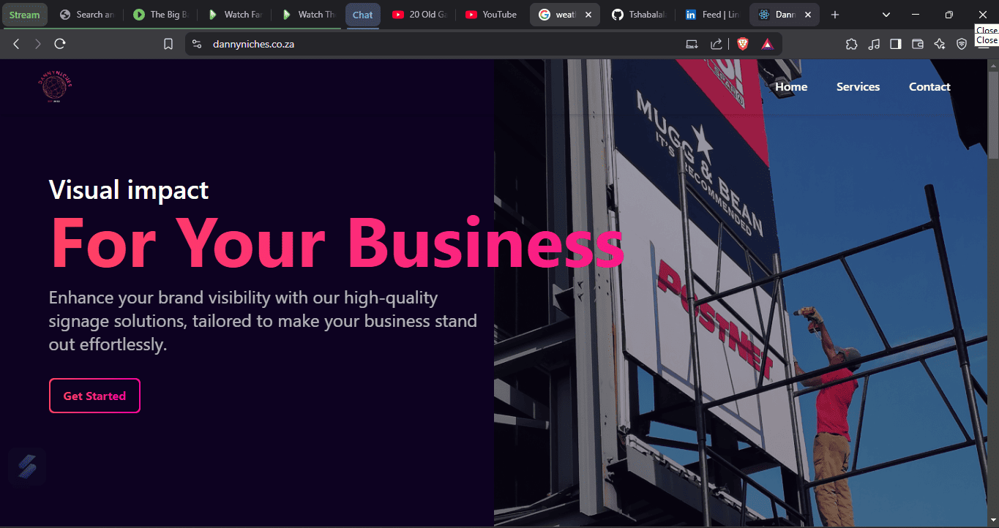
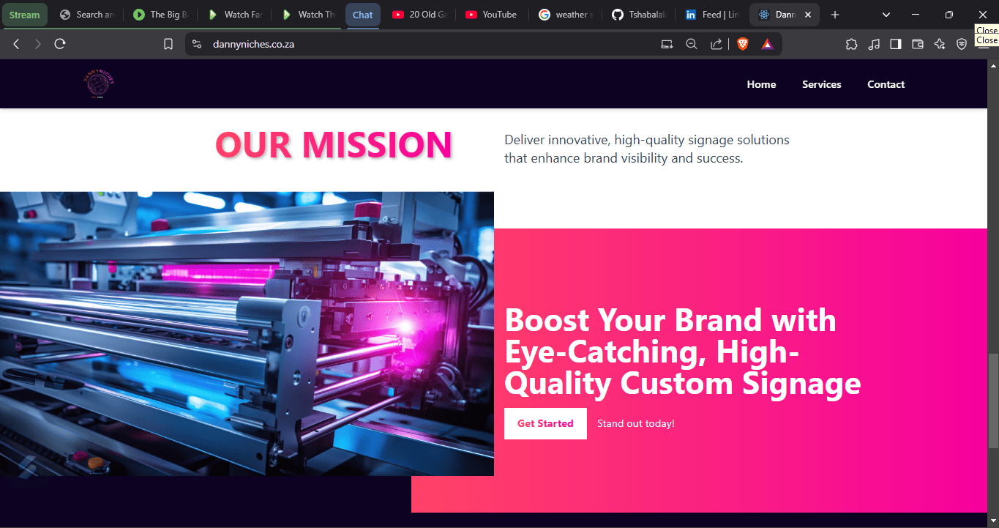

# Danny Niches Signage Solutions

A modern React-based website for Danny Niches, showcasing professional signage solutions and services. The website features a responsive design, smooth scrolling navigation, and comprehensive information about our signage services.


*Homepage featuring our visual impact statement and professional signage solutions*

## Features

- Responsive navigation with mobile menu support
- Smooth scroll functionality
- Dynamic header transparency based on scroll position
- Service showcase with grid layout
- Contact information and social media links
- Modern UI with gradient effects
- Optimized images with WebP format



## Getting Started

### Prerequisites

- Node.js (version 14 or higher)
- npm or yarn package manager

### Installation

1. Clone the repository
```bash
git clone https://github.com/yourusername/danny-niches-react.git
```
2. Navigate to the project directory
```bash
cd danny-niches-react
```
3. Install dependencies
```bash
npm install
```
4. Start the development server
```bash
npm start
```
